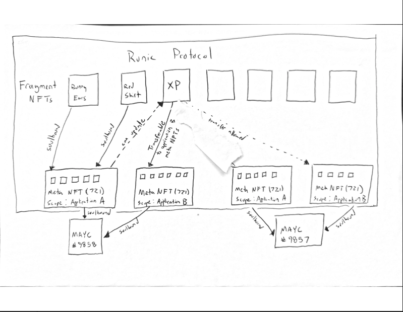

## How it works

Runic protocol lets users or developers mint new Runic Meta NFTs, or Meta NFTs soulbound to existing NFTs. These Meta NFTs enforce read/write/whitelist/transfer rules for Fragment NFTs, which themselves are NFT metadata primitives (eg., XP, coupons, in-game items, pfp attributes like a red hat). 

The protocol provides named application scopes which are the foundation for rule-based access for on-chain applications. Once claimed, a scope defines which contracts may mint NFTs and update NFT metadata.

Generated metadata contracts provide a standard system for multi-app permissions where developers can enable other applications to collaborate and write to specific fields in their metadata. Metadata is efficiently bytepacked to use as little gas as possible while also being accessible from plainly-named developer-friendly functions. More metadata fields can be added to entities in the future using an updateable contract model.

Developers express their application’s metadata and rules in json or via a UI wizard, and optimized contract code is automatically generated and deployed for them. The Runic protocol contract enforces data integrity, rules and relationships between assigned NFTs

