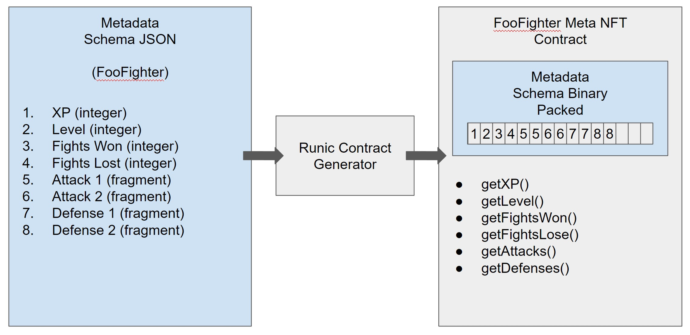
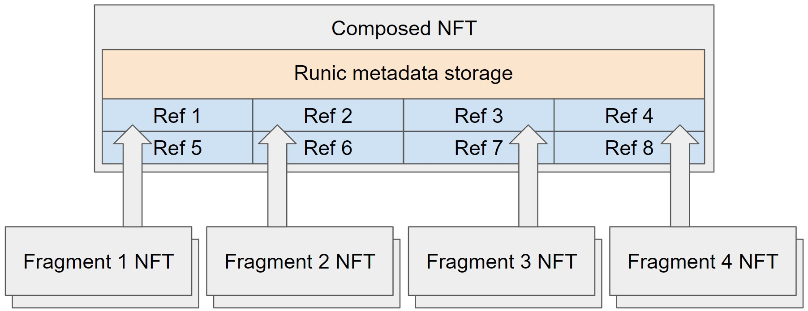
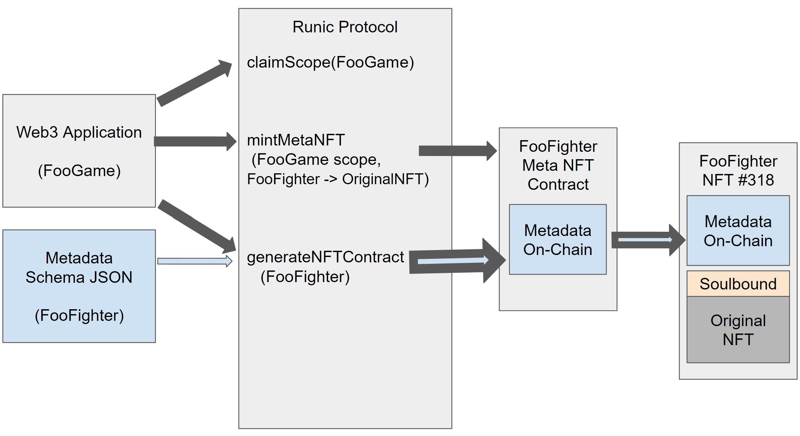

## Patchwork Standards

### ERC-721 Extensions for on-chain metadata

Patchwork ERC-721 Extensions add functions for:
* Defining metadata schema
* Storing packed binary metadata
* Retrieving packed binary  metadata
* Retrieving an image URI for a token
* Setting field-level permissions for multi-app metadata access

```solidity
interface IPatchworkNFT {
    function getScopeName() external returns (string memory);
    function schemaURI() external returns (string memory);
    function schema() external returns (MetadataSchema memory);
    function imageURI(uint256 _tokenId) external returns (string memory);
    function setPermissions(address to, uint256 permissions) external;
    function storePackedMetadataSlot(uint256 _tokenId, uint256 slot, uint256 data) external;
    function loadPackedMetadataSlot(uint256 _tokenId, uint256 slot) external returns (uint256);
    function getLockNonce(uint256 tokenId) external returns (uint256 nonce);
    function isLocked(uint256 tokenId) external returns (bool);
    function setLocked(uint256 tokenId, bool locked) external;
}
```

Metadata fields are defined in normal JSON and an optimized byte packer is generated into a new contract. To save storage, fields should be defined as short as possible. As most application-level fields are not typically larger than 64 bit and often can be a single bit flag or a small 8 or 16 bit field for counting with a small maximum, many fields can be packed into a single uint256, which is the storage word size in EVM. This allows for effective batch writes, incuring only one storage gas cost for potentially many fields.

Secure Patchwork ERC-721s are generated from the Patchwork protocol contract, which accepts metadata schemas in binary format, something our SDK will convert from JSON. Custom Patchwork ERC-721 can also be generated in Solidity client-side so that they can be customized before deployment. 

Because metadata is available on-chain, other contracts can directly read and interact with an NFT's metadata, allowing for applications that mint and update their own tokens, potentially with no fixed server infrastructure. This enables complex but gas efficient interactions such as parent-child assignment using storage-efficient referencing (see below) and NFTs as schemad application entity models.

On-chain NFT-based entity models are a way to model storage so that a web3 application can have secure, interoperable and highly accessible data. 

Here is an example of an NFT as an entity model for our application "Foo". This model is a fighter, meaning that it's an NFT which represents a fighting character in a web3 fighting game. In this example, there would be many fighters minted and they would belong to users. The application could model users with NFTs and this makes it possible to trade and sell data, such as a character, upgrade or entire account very easily and all on-chain.



### Low-storage NFT reference support

Traditional parent-child relationships require 512 bits of storage per side, requiring 4 minimum stores per relationship (2x256 for parent and 2x256 for child) at an initial cost of 80,000 gas. The Patchwork lite reference standard creates a smaller address space which allows for up to 256 whitelisted NFT addresses to be assignable to a target NFT address. The assignable NFTs are referred to as "Fragments" in the Patchwork protocol system. Fragments are part of a whole NFT, but all of them are NFTs, so they are tradeable, on-chain and have all of the qualities of a Patchwork NFT. With the lite reference implementation, it's possible to record a relationship in 2.25 stores, cutting gas use almost in half to initially 50,000 and making it far more efficient to compose NFTs where 4-8 Fragments create a new NFT. 

The use cases include having standard item sets like clothes or weapons, traits like "happy" or "sad", partitioned storage like medals and progress, coupons, boosts, modifiers and almost any adjective that a person could think of.

```solidity
interface IPatchworkLiteRef {
  function registerReferenceAddress(address ref) external returns (uint8 id);
  function redactReferenceAddress(uint8 id) external; // future / less necessary
  function getLiteReference(address addr, uint256 tokenId) external returns (uint64 referenceAddress);
  function getReferenceAddressAndTokenID(uint64 referenceAddress) external returns (address addr, uint256 tokenId);
  function addReference(uint256 ourTokenId, uint64 referenceAddress) external;
  function batchAddReferences(uint256 tokenId, uint64[] calldata liteRefs) external;
  function removeReference(uint256 ourTokenId, uint64 referenceAddress) external;
  function loadReferenceAddressAndTokenId(uint256 idx) external returns (address addr, uint256 tokenId);
  function loadAllReferences(uint256 tokenId) external returns (address[] memory addresses, uint256[] memory tokenIds);
}
```

```solidity
interface IPatchworkAssignableNFT {
    function getScopeName() external returns (string memory);
    function assign(uint256 ourTokenId, address to, uint256 tokenId) external;
    function unassign(uint256 ourTokenId) external;
    function getAssignedTo(uint256 ourTokenId) external returns (address, uint256);
    function unassignedOwnerOf(uint256 ourTokenId) external returns (address);
    function onAssignedTransfer(address from, address to, uint256 tokenId) external;
    function updateOwnership(uint256 tokenId) external;
    function patchworkCompatible_() external returns (bytes2);
}
```



### Extending existing NFTs with on-chain metadata

Patchwork NFTs can be deployed as a Patch, which is a soulbound metadata layer, effectively extending an existing NFT with on-chain metadata. Depending on the case, a developer can either import some or all of the off-chain metadata on-chain or just add their own metadata to the NFT. 

```solidity
interface IPatchworkPatch {
    function getScopeName() external returns (string memory);
    function mintPatch(address owner, address originalNFTAddress, uint originalNFTTokenId) external returns (uint256 tokenId);
    function updateOwnership(uint256 tokenId) external;
    function unpatchedOwnerOf(uint256 tokenId) external returns (address);
    function patchworkCompatible_() external returns (bytes1);
}
```

Here is a diagram showing an application "Foo" which mints a "Fighter" that can be based on an existing NFT. The "FooFighter" minted NFT is used by this and other applications and leverages the original NFT's assets and metadata.



To extend an NFT, the metadata is defined in JSON and the on-chain contract factory is used. A scope is claimed for the Foo game and is used for minting and permissions. The schema is turned into a meta contract via the generator and once minted, is bound to the original NFT, which must be owned by the address that owns the Patch.

